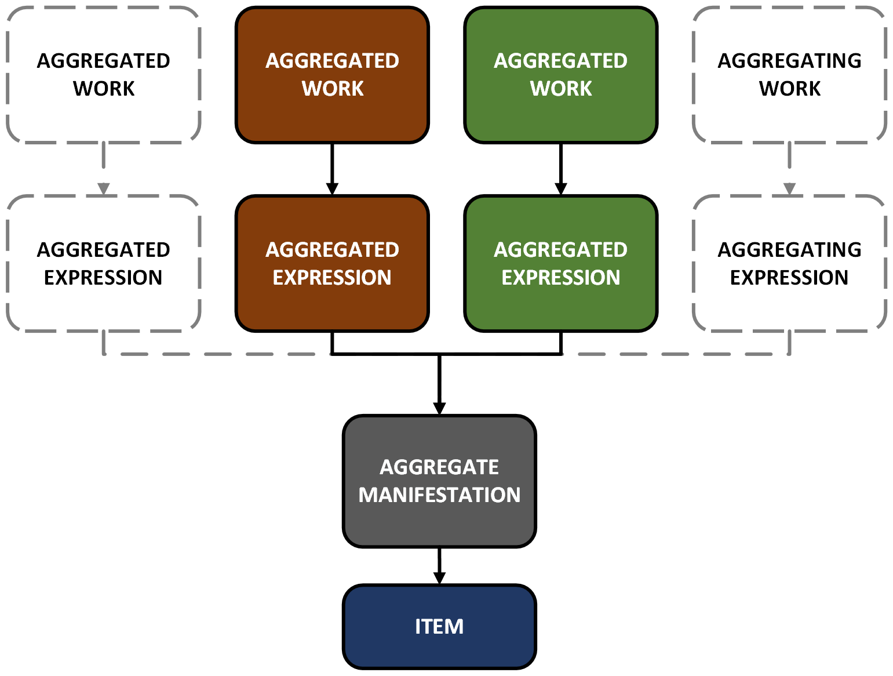
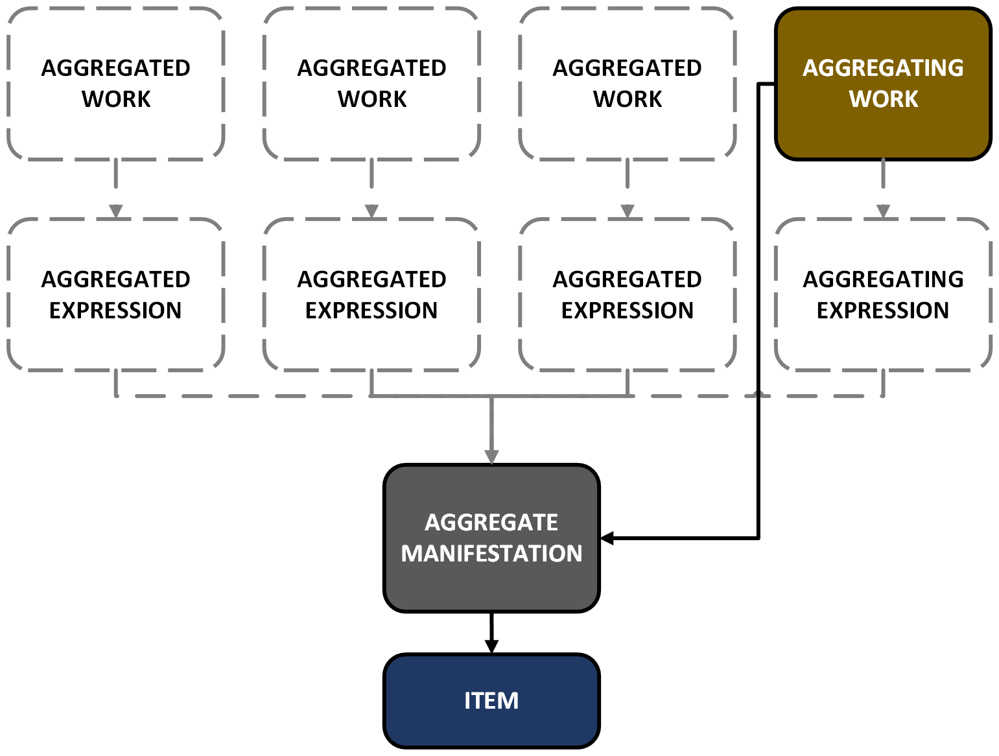
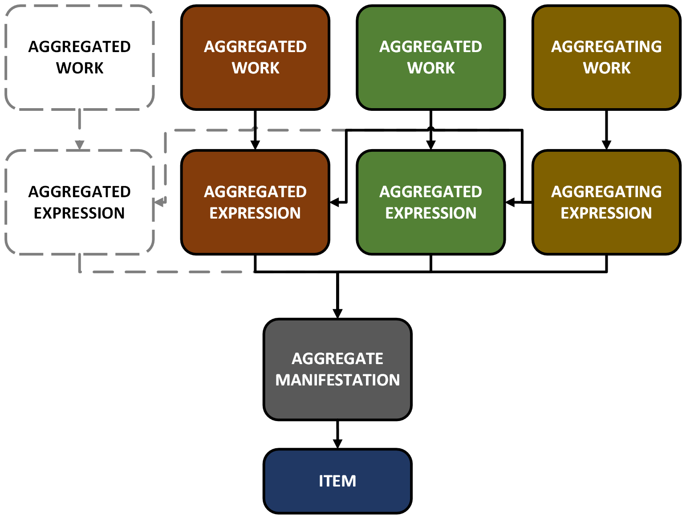

# Pre-cataloging decisions: choosing templates for describing aggregates
🚧 *DRAFT GUIDANCE DOCUMENTATION* 🚧

| OPTION | RECOMMENDED FOR |
|---|---|
| **[A](#option-a)** | An augmentation aggregate with only one primary expression; a collection or parallel aggregate where no more than three (primary) expressions are aggregated  |
| **[B](#option-b)** | A collection aggregate where more than three (primary) expressions are aggregated |
| **[C](#option-c)** | A collection aggregate where more than three (primary) expressions are aggregated, and a creator of one or more of the expressions or works that are aggregated is deemed useful to users; a parallel aggregate where more than three (primary) expressions are aggregated -- when describing aggregated expressions in this case, describe the original expression, if present, and at least the first derivative expression in the resource. |
| **[D](#option-d)** | **Not recommended**; only describe the aggregating expression when the same aggregating work (and hence the same aggregating expression) is manifested in multiple manifestations; consider the possible minor differences in augmenting content when determining whether two aggregating works are the same. |
| **[E](#option-e)** | 🚧🚧🚧 |

## Option A 
***Describe the aggregate manifestation, one or more of the expressions that are aggregated, and the works realized by these aggregated expressions***

### WEMI linking
- Link a work to its expression which using the element [has expression of work](https://access.rdatoolkit.org/en-US_ala-e23bf7e1-aa3e-3e8d-874e-9a16d0cdee57)
- Link an aggregated expression to the aggregate manifestation using the element [has manifestation of expression](https://access.rdatoolkit.org/en-US_ala-36cea3ce-03c7-3286-a342-3255b55cb4f6)
- Link the aggregate manifestation to the item using the element [has exemplar of manifestation](https://access.rdatoolkit.org/en-US_ala-03895ab3-dbcd-3f1c-b8ae-623c76d35f7f)

### Details
- Use template [UWSINOPIA:WAU:rdaExpression:printMonograph:CAMS](https://uwlib-cams.github.io/sinopia_maps/html/UWSINOPIA_WAU_rdaExpression_printMonograph_CAMS.html) for describing an aggregated expression. 
- Use template [UWSINOPIA:WAU:rdaWork:printMonograph:CAMS](https://uwlib-cams.github.io/sinopia_maps/html/UWSINOPIA_WAU_rdaWork_printMonograph_CAMS.html) for describing a work realized by an aggregated expression. 
+ Relate the manifestation to an aggregated expression using Manifestation: expression manifested. See [Toolkit option](https://access.rdatoolkit.org/en-US_ala-cf0b18a4-5a55-3358-94b0-2d4fb5449314/div_txc_vr1_ffb). 
+ Relate an aggregated expression to the manifestation using Expression: manifestation of expression. See [Toolkit option](https://access.rdatoolkit.org/en-US_ala-f2747cbc-74d2-3131-a94b-e30effad9d09/div_wb5_l2h_lhb). 
+ Relate an aggregated expression to the work realized by the expression using Expression: work expressed. See [Toolkit option](https://access.rdatoolkit.org/en-US_ala-f2747cbc-74d2-3131-a94b-e30effad9d09/div_tdm_wdh_lhb). 
+ Relate a work to an aggregated expression that realizes it using Work: expression of work. See [Toolkit option](https://access.rdatoolkit.org/en-US_ala-4d4d3f5b-8d94-3ee5-89d8-241a98366db4/div_msj_sfh_lhb). 

> ⬆ *[Return to top](#pre-cataloging-decisions-choosing-templates-for-describing-aggregates)*

## Option B 
***Describe the aggregating work and the aggregate manifestation without describing any other expression(s) or work(s)***

### WEMI linking
- Link the aggregating work to the aggregate manifestation using the shortcut element [has manifestation of work](https://access.rdatoolkit.org/en-US_ala-9a09be6d-e0f0-36db-8409-3460330b1f7e)
- Link the aggregate manifestation to the item using the element [has exemplar of manifestation](https://access.rdatoolkit.org/en-US_ala-03895ab3-dbcd-3f1c-b8ae-623c76d35f7f)

### Details
- Use template [UWSINOPIA:WAU:rdaWork:aggregating_printMonograph:CAMS](https://uwlib-cams.github.io/sinopia_maps/html/UWSINOPIA_WAU_rdaWork_aggregating_printMonograph_CAMS.html) for describing the aggregating work. 
+ Relate the manifestation to the aggregating work using Manifestation: work manifested. See [Toolkit option](https://access.rdatoolkit.org/en-US_ala-cf0b18a4-5a55-3358-94b0-2d4fb5449314/div_gml_qm4_j3b).
+ Relate the aggregating work to the manifestation using Work: manifestation of work. See [Toolkit option](https://access.rdatoolkit.org/en-US_ala-4d4d3f5b-8d94-3ee5-89d8-241a98366db4/div_vfh_zfh_lhb).
- Record the attributes of one or more of the expressions that are aggregated using representative expression elements of the aggregating work. See [Toolkit guidance](https://access.rdatoolkit.org/en-US_ala-4d4d3f5b-8d94-3ee5-89d8-241a98366db4/div_dv4_rvn_2fb). 
<!-- - Collocate aggregating works that belong in the same work group using Work: authorized access point for work group or Work: identifier for work group. See [Toolkit guidance](https://access.rdatoolkit.org/en-US_ala-4d4d3f5b-8d94-3ee5-89d8-241a98366db4/section_y4p_p24_2fb). -->
+ Record a creator of the aggregating work using Work: creator agent of work or Work: aggregator agent or a more appropriate narrower element. See [Toolkit option](https://access.rdatoolkit.org/en-US_ala-4d4d3f5b-8d94-3ee5-89d8-241a98366db4/div_dv4_rvn_2fb). 
- Record a creator of one or more of the expressions or works that are aggregated using Manifestation: contributor agent to aggregate. See [Toolkit option](https://access.rdatoolkit.org/en-US_ala-cf0b18a4-5a55-3358-94b0-2d4fb5449314/div_pd1_wr1_ffb). 
- Do not record a creator of one or more of the works that are aggregated as a creator of the aggregating work, unless they happen to be the same agent. 

> ⬆ *[Return to top](#pre-cataloging-decisions-choosing-templates-for-describing-aggregates)*

## Option C 
***Describe the aggregating work and aggregate manifestation, and describe one or more aggregated expressions and the works realized by these***

### WEMI linking
- Link the aggregating work to the aggregate manifestation using the shortcut element [has manifestation of work](https://access.rdatoolkit.org/en-US_ala-9a09be6d-e0f0-36db-8409-3460330b1f7e)
- Link a work to its aggregated expression which using the element [has expression of work](https://access.rdatoolkit.org/en-US_ala-e23bf7e1-aa3e-3e8d-874e-9a16d0cdee57)
- Link an aggregated expression to the aggregate manifestation using the element [has manifestation of expression](https://access.rdatoolkit.org/en-US_ala-36cea3ce-03c7-3286-a342-3255b55cb4f6)
- Link the aggregate manifestation to the item using the element [has exemplar of manifestation](https://access.rdatoolkit.org/en-US_ala-03895ab3-dbcd-3f1c-b8ae-623c76d35f7f)

### Details
- For guidance on describing the aggregating work, see [Option B](#option-b). 
- For guidance on describing an aggregated expression and the work realized, see [Option A](#option-a). 

> ⬆ *[Return to top](#pre-cataloging-decisions-choosing-templates-for-describing-aggregates)*

## Option D
**&#x26a0; apply with caution**  
***Describe the aggregating work, aggregating expression, and aggregate manifestation, describe one or more aggregated expressions and the work(s) realized by these***

### WEMI linking
- Link the aggregating work to its aggregating expression using the element [has expression of work](https://access.rdatoolkit.org/en-US_ala-e23bf7e1-aa3e-3e8d-874e-9a16d0cdee57)
- Link the aggregating expression to the aggregate manifestation using the element [has manifestation of expression](https://access.rdatoolkit.org/en-US_ala-36cea3ce-03c7-3286-a342-3255b55cb4f6)
- Link the aggregating expression to an aggregated expression or expressions using the element [aggregates](https://access.rdatoolkit.org/en-US_ala-bb5ed4f5-d28a-3fd1-8634-bcac85cb3287)
- Link a work to its aggregated expression which using the element [has expression of work](https://access.rdatoolkit.org/en-US_ala-e23bf7e1-aa3e-3e8d-874e-9a16d0cdee57)
- Link an aggregated expression to the aggregate manifestation using the element [has manifestation of expression](https://access.rdatoolkit.org/en-US_ala-36cea3ce-03c7-3286-a342-3255b55cb4f6)
- Link the aggregate manifestation to the item using the element [has exemplar of manifestation](https://access.rdatoolkit.org/en-US_ala-03895ab3-dbcd-3f1c-b8ae-623c76d35f7f)

### Details
- Use template [UWSINOPIA:WAU:rdaExpression:aggregating_printMonograph:CAMS](https://uwlib-cams.github.io/sinopia_maps/html/UWSINOPIA_WAU_rdaExpression_aggregating_printMonograph_CAMS.html) for describing the aggregating expression. 
- Also describe one or more of the expressions that are aggregated and the works realized by the expressions. 
+ Relate the aggregating expression to the manifestation using Expression: manifestation of expression. See [Toolkit option](https://access.rdatoolkit.org/en-US_ala-f2747cbc-74d2-3131-a94b-e30effad9d09/div_wb5_l2h_lhb). 
+ Relate the aggregating expression to the aggregating work using Expression: work expressed. See [Toolkit option](https://access.rdatoolkit.org/en-US_ala-f2747cbc-74d2-3131-a94b-e30effad9d09/div_tdm_wdh_lhb). 
+ Relate the aggregating expression to one or more of the expressions that are aggregated using Expression: aggregates. See [Toolkit option](https://access.rdatoolkit.org/en-US_ala-f2747cbc-74d2-3131-a94b-e30effad9d09/div_uwg_5tt_2fb). 
+ Relate an aggregated expression to the aggregating expression using Expression: aggregated by. See [Toolkit option](https://access.rdatoolkit.org/en-US_ala-f2747cbc-74d2-3131-a94b-e30effad9d09/div_q5k_5vt_2fb).
- For guidance on describing the aggregating work, see Option B. 
- Ror guidance on describing an aggregated expression and the work realized, see [Option A](#option-a). 

> ⬆ *[Return to top](#pre-cataloging-decisions-choosing-templates-for-describing-aggregates)*

## Option E
***Describe the aggregating work and aggregate manifestation, and a work or works which are realized by an expression or expressions which are aggregated, but without descibing those expressions***

### WEMI linking
- Link the aggregating work to the aggregate manifestation using the shortcut element [has manifestation of work](https://access.rdatoolkit.org/en-US_ala-9a09be6d-e0f0-36db-8409-3460330b1f7e)
- Link a work or works which are realized by an expression or expressions which are aggregated using this same element, [has manifestation of work](https://access.rdatoolkit.org/en-US_ala-9a09be6d-e0f0-36db-8409-3460330b1f7e) - for more information see RDA Toolkit > Guidance > Describing a manifestation > [Describing a manifestation that embodies two or more expressions](https://access.rdatoolkit.org/en-US_ala-cf0b18a4-5a55-3358-94b0-2d4fb5449314/section_qfv_vc3_42b) > condition: "A manifestation is an aggregate" > [option](https://access.rdatoolkit.org/en-US_ala-cf0b18a4-5a55-3358-94b0-2d4fb5449314/div_p12_yl4_j3b)

### Details
🚧🚧🚧

> ⬆ *[Return to top](#pre-cataloging-decisions-choosing-templates-for-describing-aggregates)*
