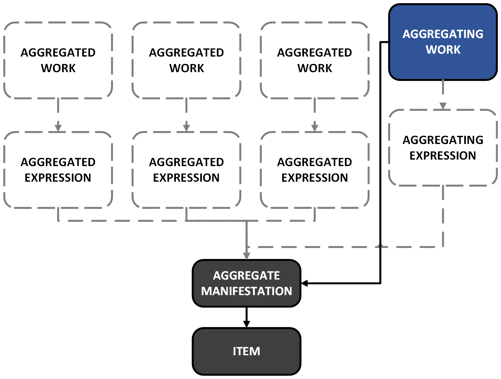

# Aggregating work

## Notes on aggregating work

### Use cases for describing an aggregating work
- To record an [aggregator person](http://rdaregistry.info/Elements/w/P10448), [corporate body](http://rdaregistry.info/Elements/w/P10542), or [family](http://rdaregistry.info/Elements/w/P10589)
- From [discussion](https://github.com/uwlib-cams/sinopia_maps/discussions/180#discussioncomment-7641895):

> The presence of a collective title that is distinct from any of the 'collected' titles is, in many contexts, a strong indication that an aggregating work should be minted. However, there is little data utility in doing this if the only statement for the aggregating work is:  
> `<aggregatingWork> <has preferred title of work> 'Collective title of aggregate manifestation' .`  
> because it is likely that it is already stated:  
> `<aggregateManifestation> <has title proper> 'Collective title of aggregate manifestation' .`  

